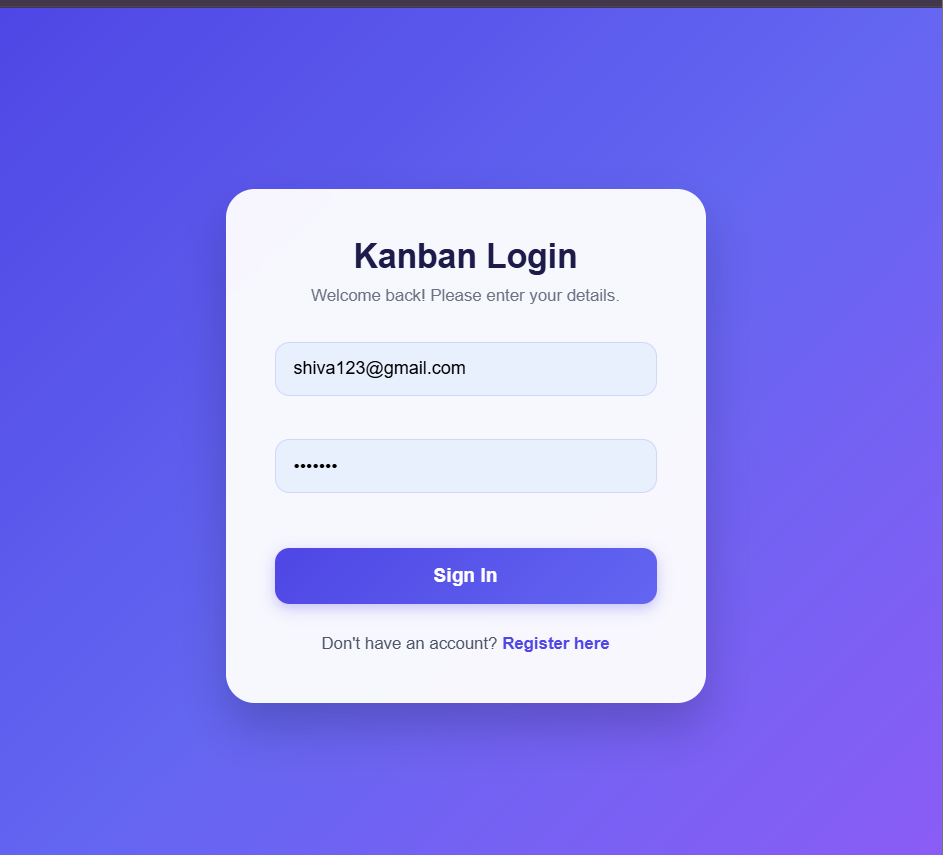
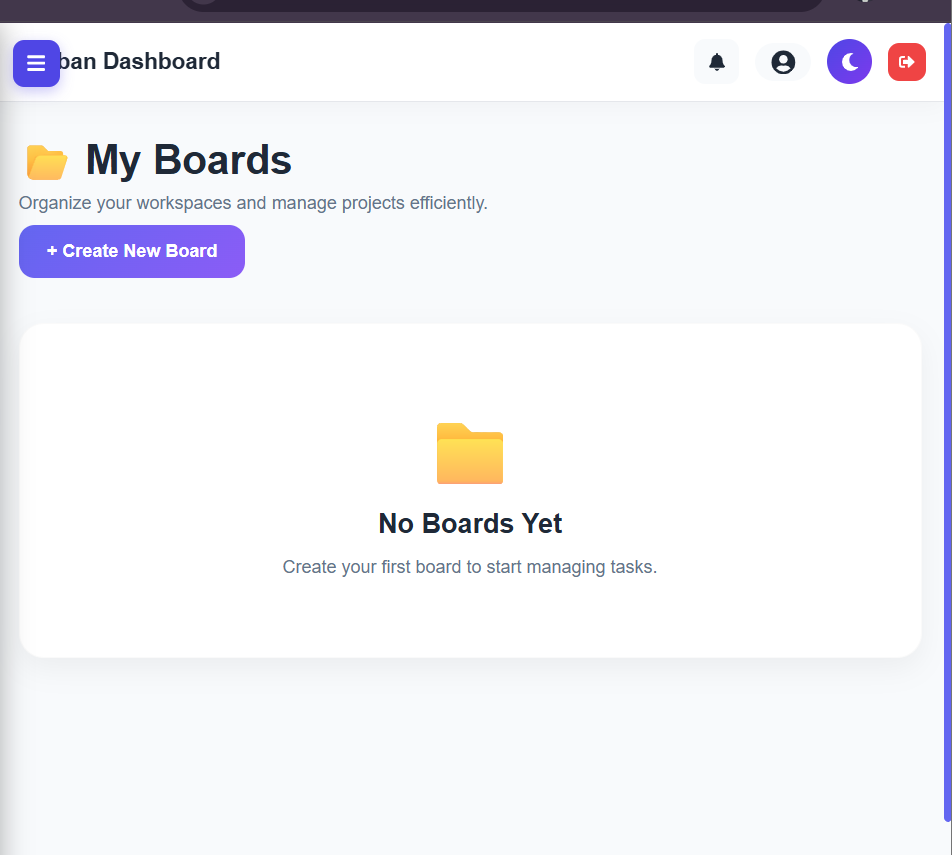
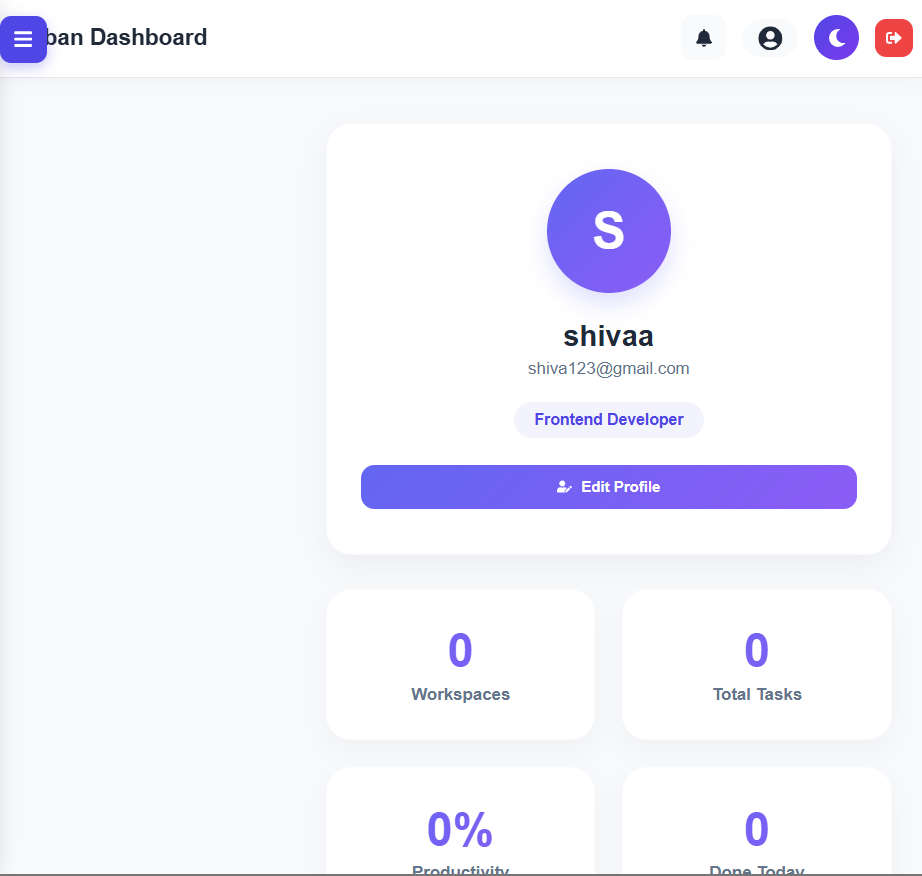

# 🚀 KanbanX – Full Stack Task Management Application

KanbanX is a modern full-stack task management application inspired by Kanban boards. It helps users organize tasks efficiently using boards and task cards while providing secure authentication with JWT.

🌐 **Live Demo:** https://kanbanx-frontend-mobk.onrender.com

🔗 **Backend API:** https://kanbanx-backend-w554.onrender.com

📂 **GitHub Repository:** https://github.com/Dikshithab/KanbanX

---

# 📌 Features

### 🔐 Authentication
- User Registration
- Secure Login
- JWT Authentication
- Password Encryption using BCrypt
- Protected Routes

### 📋 Board Management
- Create Boards
- Edit Boards
- Delete Boards
- View All Boards

### ✅ Task Management
- Create Tasks
- Update Tasks
- Delete Tasks
- Move Tasks Between Columns
- Track Task Status

### 👤 User Profile
- View Profile
- Update Profile
- Change Password

### 📊 Dashboard
- Board Statistics
- Task Summary
- Responsive Dashboard

---

# 🛠 Tech Stack

## Frontend
- React.js
- Vite
- Axios
- HTML5
- CSS3
- JavaScript

## Backend
- Spring Boot
- Spring Security
- JWT Authentication
- Spring Data JPA
- Hibernate

## Database
- MySQL

## Deployment
- Render (Frontend)
- Render (Backend)

---

# 📂 Project Structure

```
KanbanX
│
├── backend
│   ├── controller
│   ├── service
│   ├── repository
│   ├── entity
│   ├── config
│   ├── dto
│   └── security
│
└── frontend
    ├── src
    │   ├── components
    │   ├── pages
    │   ├── context
    │   ├── api
    │   └── assets
    └── public
```

---

# 🚀 Installation

## Clone Repository

```bash
git clone https://github.com/Dikshithab/KanbanX.git
```

## Backend

```bash
cd backend
./mvnw spring-boot:run
```

Backend runs on:

```
http://localhost:8080
```

---

## Frontend

```bash
cd frontend
npm install
npm run dev
```

Frontend runs on:

```
http://localhost:5173
```

---

# 🔑 Environment Variables

Configure the following before running:

### Backend

```
spring.datasource.url=YOUR_DATABASE_URL
spring.datasource.username=YOUR_DATABASE_USERNAME
spring.datasource.password=YOUR_DATABASE_PASSWORD

jwt.secret=YOUR_SECRET_KEY
```

---

# 📸 Screenshots

## Login Page


---

## Dashboard


---

## Board Management


---

## Profile Setting



---

# 🎯 Future Improvements

- Drag & Drop Tasks
- Due Date Reminders
- Task Labels
- Dark Mode
- Team Collaboration
- Email Notifications
- Activity History
- Search & Filters

---

# 🎓 What I Learned

During this project I gained hands-on experience in:

- Full Stack Development
- REST API Development
- Spring Boot
- Spring Security
- JWT Authentication
- MySQL Database Design
- React State Management
- Axios API Integration
- CORS Configuration
- Deployment using Render
- Git & GitHub

---

# 👨‍💻 Author

**Shiva Dikshitha Burra**

📧 Email: shivadikshithaburra0@gmail.com

🔗 GitHub: https://github.com/Dikshithab

💼 LinkedIn: *(Add your LinkedIn profile URL here)*

---

# ⭐ If you like this project

Give this repository a ⭐ on GitHub!
